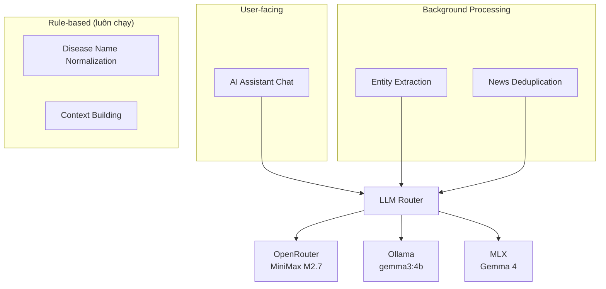
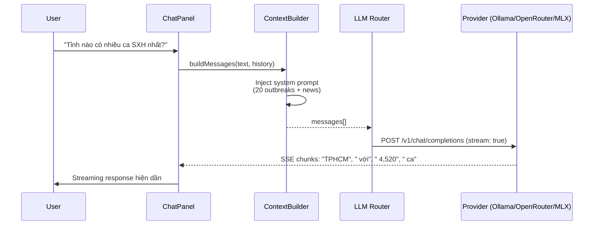

# AI Features Guide — Epidemic Monitor

Tài liệu chi tiết về tất cả tính năng AI/LLM trong hệ thống. Mô tả model nào, giải quyết vấn đề gì, hoạt động như thế nào.

---

## Tổng quan

LLM là **enhancement layer**, không phải dependency. App hoạt động đầy đủ khi không có LLM — chỉ thiếu chat + auto-enrichment.



---

## 1. AI Assistant Chat

| | |
|---|---|
| **Files** | `chat-panel.ts`, `llm-router.ts`, `llm-context-builder.ts` |
| **Model mặc định** | OpenRouter: `minimax/minimax-m1-80k` |
| **Model local** | Ollama: gemma3:4b, qwen3:4b, llama3.2:3b / MLX: Gemma 4 |
| **Trigger** | User gửi message trong chat panel |
| **Bắt buộc?** | Không — panel vẫn render, hiện "No LLM available" nếu không có provider |

### Vấn đề
Nhân viên y tế cần tra cứu nhanh dữ liệu dịch bệnh: "Tỉnh nào có nhiều ca SXH nhất?", "So sánh TPHCM và Hà Nội", "Tóm tắt tình hình tuần này". Đọc bảng số liệu mất thời gian.

### Giải pháp
Chat panel cho phép hỏi bằng ngôn ngữ tự nhiên (Việt/Anh). LLM nhận system prompt chứa dữ liệu thực (top 20 outbreaks + all news) → trả lời data-grounded, không hallucinate.

### Cách hoạt động



### System Prompt Template
```
You are an epidemic monitoring assistant for Vietnam.
You have access to the following real-time data:

## Active Outbreaks (20)
- Sốt xuất huyết (Dengue) in Vietnam [ALERT] — 4520 cases
- Sốt xuất huyết (Dengue) in Vietnam [WARNING] — 1850 cases
...

## Recent News
- [MOH-VN] Bộ Y tế cảnh báo dịch sốt xuất huyết bùng phát...
- [WHO-VN] WHO supports Vietnam dengue response...
...

Rules:
- Answer based ONLY on the data above
- If data is insufficient, say so clearly
- Respond in the same language as the user's question
```

### Ví dụ thực tế (đã test với Ollama gemma3:4b)
- Input: "Tỉnh nào có nhiều ca sốt xuất huyết nhất?"
- Output: "Dựa trên dữ liệu hiện tại, TPHCM có số ca sốt xuất huyết cao nhất với 4,520 ca."

---

## 2. Disease Name Normalization

| | |
|---|---|
| **File** | `llm-data-pipeline.ts` → `normalizeDiseaseNameRule()` |
| **Model** | Rule-based — KHÔNG cần LLM |
| **Trigger** | Tự động mỗi lần fetch outbreak data |
| **Bắt buộc?** | Luôn chạy |

### Vấn đề
WHO RSS trả về tên bệnh không nhất quán: "Dengue Fever", "dengue", "DENGUE", "Avian Influenza A(H5N1)". Hiển thị lộn xộn, không gộp được thống kê.

### Giải pháp
Map 14 alias → tên chuẩn song ngữ Việt-Anh:

| Alias (từ nguồn dữ liệu) | Chuẩn hóa thành |
|---------------------------|-----------------|
| dengue, dengue fever | Sốt xuất huyết (Dengue) |
| covid, covid-19, coronavirus | COVID-19 |
| hand, foot and mouth, hfmd | Tay chân miệng (HFMD) |
| influenza, influenza a | Cúm A (Influenza A) |
| measles | Sởi (Measles) |
| cholera | Tả (Cholera) |
| mpox | Đậu mùa khỉ (Mpox) |
| avian influenza | Cúm gia cầm (Avian Influenza) |
| rabies | Dại (Rabies) |
| typhoid | Thương hàn (Typhoid) |
| malaria | Sốt rét (Malaria) |

**Tại sao rule-based?** Danh sách bệnh hữu hạn (~15), pattern match đơn giản, nhanh (0ms), không cần LLM call. YAGNI.

---

## 3. Entity Extraction (LLM-powered)

| | |
|---|---|
| **File** | `llm-data-pipeline.ts` → `enrichOutbreaksBatch()` |
| **Model** | `complete()` từ active provider (non-streaming) |
| **Trigger** | Background, sau data fetch, chỉ khi LLM available |
| **Bắt buộc?** | Không — nếu LLM unavailable, outbreaks vẫn hiển thị (thiếu case counts) |

### Vấn đề
Outbreak summaries chứa case counts dạng text: "Số ca sốt xuất huyết tăng mạnh tại TP.HCM, đặc biệt ở các quận 12, Bình Tân, Gò Vấp." — cần extract thành structured data.

### Giải pháp
Batch 5 outbreak summaries → LLM extract JSON:

**Prompt:**
```
Extract case counts from these outbreak summaries. Return JSON array.
Each entry: { "id": "...", "cases": number|null, "deaths": number|null }

[0] id="vn-deng-hcm" — Số ca sốt xuất huyết tăng mạnh tại TP.HCM...
[1] id="vn-deng-hn" — Ca mắc sốt xuất huyết gia tăng tại Hà Nội...

Return ONLY valid JSON array, no explanation.
```

**LLM Response:**
```json
[{"id": "vn-deng-hcm", "cases": 4520, "deaths": 3}, ...]
```

**Cache:** Mỗi outbreak ID chỉ extract 1 lần → cache kết quả, tránh gọi LLM lặp.

---

## 4. News Deduplication (LLM-powered)

| | |
|---|---|
| **File** | `llm-data-pipeline.ts` → `markDuplicateNews()` |
| **Model** | `complete()` từ active provider (non-streaming) |
| **Trigger** | Background, sau news fetch, chỉ khi LLM available + >5 news items |
| **Bắt buộc?** | Không — nếu LLM unavailable, hiện tất cả tin (chấp nhận trùng) |

### Vấn đề
7 RSS feeds → cùng 1 sự kiện xuất hiện nhiều lần. VD: WHO và MOH-VN cùng đưa tin "SXH bùng phát ở miền Nam" → hiển thị trùng.

### Giải pháp
LLM compare 10 headlines đầu tiên → tìm cặp trùng:

**Prompt:**
```
Which of these headlines describe the SAME event? Return pairs as JSON.

[0] Bộ Y tế cảnh báo dịch SXH bùng phát mạnh tại miền Nam
[1] WHO supports Vietnam dengue response in southern provinces
[2] TP.HCM triển khai chiến dịch diệt lăng quăng...
...

Return ONLY valid JSON array.
```

**LLM Response:** `[[0, 1]]` — headline 0 và 1 cùng sự kiện.

→ Mark `news[1].category = 'duplicate'` → consumer có thể filter.

---

## 5. LLM Provider System

### Architecture

```mermaid
graph LR
    subgraph "Auto-detect (parallel ping)"
        R[LLM Router<br/>initLLM()]
    end
    
    R -->|"API key?"| OR[OpenRouter<br/>openrouter.ai/api/v1<br/>MiniMax M2.7]
    R -->|"localhost:11434?"| OL[Ollama<br/>gemma3:4b<br/>qwen3:4b]
    R -->|"localhost:8080?"| MX[MLX<br/>Gemma 4<br/>Apple Silicon]
    
    OR -.->|"All use"| API[OpenAI-compatible<br/>/v1/chat/completions]
    OL -.-> API
    MX -.-> API
```

### Provider Priority
1. **OpenRouter** (web default) — cần API key trong localStorage
2. **Ollama** (local) — user tự cài, ping `localhost:11434`
3. **MLX** (local) — Apple Silicon native, ping `localhost:8080`

### Detection Flow
```ts
initLLM() → Promise.allSettled([
  openrouter.ping(),  // check API key + reachable
  ollama.ping(),      // check localhost:11434/api/tags
  mlx.ping(),         // check localhost:8080/v1/models
]) → chọn first available → set active provider
```

### Streaming (SSE)
Chat dùng streaming qua Server-Sent Events:
- Request: `POST /v1/chat/completions` với `stream: true`
- Response: `data: {"choices":[{"delta":{"content":"text"}}]}\n\n`
- Parser: `llm-sse-stream-reader.ts` — shared bởi cả 3 providers

### Fallback Strategy
| Tình huống | Hành vi |
|------------|---------|
| Không có provider nào | Chat disabled, panel hiện "No LLM available" |
| Provider chạy nhưng lỗi | Hiện "[Error: LLM request failed]" trong chat |
| Ollama chạy nhưng OpenRouter ưu tiên | User chọn provider trong settings |

---

## Tổng kết

| # | Tính năng | Model | Khi nào chạy | Bắt buộc? | Fallback |
|---|-----------|-------|-------------|-----------|----------|
| 1 | Chat hỏi đáp | Active provider (streaming) | User gửi message | Không | Panel vẫn render |
| 2 | Disease normalization | Rule-based (14 alias) | Mỗi data fetch | Luôn | N/A (không cần LLM) |
| 3 | Entity extraction | Active provider (batch) | Background sau fetch | Không | Skip, data vẫn hiện |
| 4 | News dedup | Active provider (batch) | Background sau fetch | Không | Hiện tất cả tin |
| 5 | Context building | N/A (string template) | Trước mỗi chat | Tự động | N/A |

**Thiết kế nguyên tắc**: LLM enhance, không block. App hoạt động 100% khi offline — LLM chỉ thêm intelligence layer.
