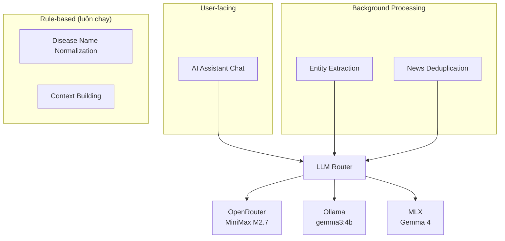
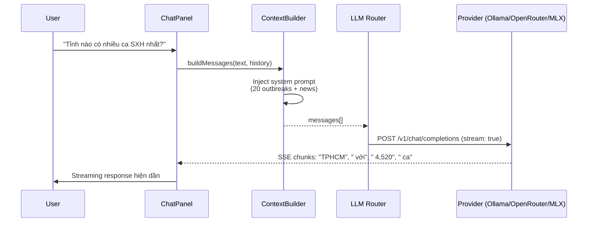

# AI Features Guide — Epidemic Monitor

Tài liệu chi tiết về tất cả tính năng AI/LLM trong hệ thống. Mô tả model nào, giải quyết vấn đề gì, hoạt động như thế nào.

---

## Tổng quan

LLM là **enhancement layer**, không phải dependency. App hoạt động đầy đủ khi không có LLM — chỉ thiếu chat + auto-enrichment.



---

## 1. AI Assistant Chat

| | |
|---|---|
| **Files** | `chat-panel.ts`, `llm-router.ts`, `llm-context-builder.ts` |
| **Model mặc định** | OpenRouter: `minimax/minimax-m1-80k` |
| **Model local** | Ollama: gemma3:4b, qwen3:4b, llama3.2:3b / MLX: Gemma 4 |
| **Trigger** | User gửi message trong chat panel |
| **Bắt buộc?** | Không — panel vẫn render, hiện "No LLM available" nếu không có provider |

### Vấn đề
Nhân viên y tế cần tra cứu nhanh dữ liệu dịch bệnh: "Tỉnh nào có nhiều ca SXH nhất?", "So sánh TPHCM và Hà Nội", "Tóm tắt tình hình tuần này". Đọc bảng số liệu mất thời gian.

### Giải pháp
Chat panel cho phép hỏi bằng ngôn ngữ tự nhiên (Việt/Anh). LLM nhận system prompt chứa dữ liệu thực (top 20 outbreaks + all news) → trả lời data-grounded, không hallucinate.

### Cách hoạt động



### System Prompt Template
```
You are an epidemic monitoring assistant for Vietnam.
You have access to the following real-time data:

## Active Outbreaks (20)
- Sốt xuất huyết (Dengue) in Vietnam [ALERT] — 4520 cases
- Sốt xuất huyết (Dengue) in Vietnam [WARNING] — 1850 cases
...

## Recent News
- [MOH-VN] Bộ Y tế cảnh báo dịch sốt xuất huyết bùng phát...
- [WHO-VN] WHO supports Vietnam dengue response...
...

Rules:
- Answer based ONLY on the data above
- If data is insufficient, say so clearly
- Respond in the same language as the user's question
```

### Ví dụ thực tế (đã test với Ollama gemma3:4b)
- Input: "Tỉnh nào có nhiều ca sốt xuất huyết nhất?"
- Output: "Dựa trên dữ liệu hiện tại, TPHCM có số ca sốt xuất huyết cao nhất với 4,520 ca."

---

## 2. Disease Name Normalization

| | |
|---|---|
| **File** | `llm-data-pipeline.ts` → `normalizeDiseaseNameRule()` |
| **Model** | Rule-based — KHÔNG cần LLM |
| **Trigger** | Tự động mỗi lần fetch outbreak data |
| **Bắt buộc?** | Luôn chạy |

### Vấn đề
VN RSS + WHO feeds trả về tên bệnh inconsistent: "Dengue Fever", "dengue", "SXH", "Avian Influenza A(H5N1)". Hiển thị lộn xộn, không gộp thống kê.

### Giải pháp
Map 67 aliases (EN+VN) → tên chuẩn song ngữ:

| Alias Examples | Standard Name |
|---|---|
| dengue, dengue fever, sốt xuất huyết, sxh | Sốt xuất huyết (Dengue) |
| covid, covid-19, coronavirus, covid-19, c19 | COVID-19 |
| hand foot mouth, hfmd, tay chân miệng, tcm | Tay chân miệng (HFMD) |
| influenza, flu, cúm, cúm a, avian flu | Cúm A (Influenza A) |
| measles, sởi, seo | Sởi (Measles) |
| cholera, tả | Tả (Cholera) |
| mpox, monkeypox, đậu mùa khỉ | Đậu mùa khỉ (Mpox) |
| polio, bại liệt | Bại liệt (Polio) |
| tb, lao, tuberculosis, phổi | Lao (Tuberculosis) |
| typhoid, thương hàn | Thương hàn (Typhoid) |
| hepatitis, viêm gan | Viêm gan (Hepatitis) |

**Tại sao rule-based?** Danh sách bệnh hữu hạn (~15 chính), pattern match đơn giản, nhanh (0ms), không cần LLM. YAGNI. Cập nhật bằng regex lookup table.

---

## 3. Entity Extraction (LLM-powered)

| | |
|---|---|
| **File** | `llm-entity-extraction-service.ts` → `src/services/article-content-fetcher.ts` |
| **Model** | `complete()` from active provider (non-streaming) |
| **Trigger** | Background, after article crawl via crawl4ai + LLM |
| **Bắt buộc?** | Không — outbreaks vẫn render (cases/deaths/wards missing) |

### Vấn đề
Crawl4ai fetches full article text. Extract structured fields:
- **cases**: Case count from article body
- **deaths**: Fatality count
- **wards**: Ward/district names (from vietnam-wards-database.ts)
- **dates**: Outbreak start/end dates

### Giải pháp
Batch article texts → LLM extract JSON:

**Prompt template** (in `llm-entity-extraction-service.ts`):
```
Extract epidemic data from these articles. Return JSON array.
For each article, extract: cases, deaths, affected_wards, date_range.

Article 1: {article_text}
Article 2: {article_text}
...

Return ONLY valid JSON array:
[
  {"id": "...", "cases": int|null, "deaths": int|null, 
   "affected_wards": ["Ward A", "Ward B"], "date_start": "2026-04-01"},
  ...
]
```

**Status**: Background extraction, cases/deaths/districts still 0% because:
1. Many crawled articles are health guides, not outbreak reports
2. LLM extraction needs long processing time per batch
3. Matching ward names to coordinates requires cross-reference

**Cache:** Per-outbreak-ID, avoid duplicate extractions.

---

## 4. News Deduplication (Multi-tier)

| | |
|---|---|
| **File** | `llm-data-pipeline.ts` → Tier 1: `news-dedup-rules.ts`, Tier 2: LLM |
| **Model** | Tier 1: Jaccard, Tier 2: `complete()` from provider |
| **Trigger** | After news fetch, always Tier 1 + Tier 2 if ambiguous |
| **Bắt buộc?** | Tier 1 luôn; Tier 2 tùy LLM available |

### Vấn đề
6 VN RSS feeds (VnExpress, Tuổi Trẻ, Thanh Niên, VietnamNet, WHO, CDC-EID) → duplicate coverage. Same event reported by multiple sources.

### Giải pháp

**Tier 1: Jaccard Similarity (deterministic)**
- Compare headlines: intersection/union of words
- Threshold: 0.4 → mark as potential duplicate
- Fast, no LLM needed

**Tier 2: LLM (for ambiguous pairs)**
- If Tier 1 score 0.3-0.5 → send to LLM for semantic comparison
- Prompt: "Do these 2 headlines describe the SAME event?"
- Response: confidence score

**Output:**
```
news[i].isDuplicate = true  // marked by Tier 1 or Tier 2
news[i].masterItem = j      // points to canonical item
```

UI filters or highlights duplicates. Allows user to "merge" or "hide" variants of same story.

---

## 5. LLM Provider System

### Architecture

```mermaid
graph LR
    subgraph "Auto-detect (parallel ping)"
        R[LLM Router<br/>initLLM()]
    end
    
    R -->|"API key?"| OR[OpenRouter<br/>openrouter.ai/api/v1<br/>MiniMax M2.7]
    R -->|"localhost:11434?"| OL[Ollama<br/>gemma3:4b<br/>qwen3:4b]
    R -->|"localhost:8080?"| MX[MLX<br/>Gemma 4<br/>Apple Silicon]
    
    OR -.->|"All use"| API[OpenAI-compatible<br/>/v1/chat/completions]
    OL -.-> API
    MX -.-> API
```

### Provider Priority
1. **OpenRouter** (web default) — cần API key trong localStorage
2. **Ollama** (local) — user tự cài, ping `localhost:11434`
3. **MLX** (local) — Apple Silicon native, ping `localhost:8080`

### Detection Flow
```ts
initLLM() → Promise.allSettled([
  openrouter.ping(),  // check API key + reachable
  ollama.ping(),      // check localhost:11434/api/tags
  mlx.ping(),         // check localhost:8080/v1/models
]) → chọn first available → set active provider
```

### Streaming (SSE)
Chat dùng streaming qua Server-Sent Events:
- Request: `POST /v1/chat/completions` với `stream: true`
- Response: `data: {"choices":[{"delta":{"content":"text"}}]}\n\n`
- Parser: `llm-sse-stream-reader.ts` — shared bởi cả 3 providers

### Fallback Strategy
| Tình huống | Hành vi |
|------------|---------|
| Không có provider nào | Chat disabled, panel hiện "No LLM available" |
| Provider chạy nhưng lỗi | Hiện "[Error: LLM request failed]" trong chat |
| Ollama chạy nhưng OpenRouter ưu tiên | User chọn provider trong settings |

---

## Advanced Features

### YouTube Transcript Extraction
- **File**: `src/services/youtube-transcript-service.ts`
- **Use**: Extract captions from epidemic-related YouTube videos
- **Provider**: YouTube Data API v3 (requires API key) or yt-dlp fallback
- **Status**: Configured, not actively used in current UI

### Article Content Fetcher
- **File**: `src/services/article-content-fetcher.ts`
- **Method**: crawl4ai (Python, full JS-render) OR fallback simple fetch
- **Python location**: `/tmp/crawl4ai-env/` (venv with crawl4ai)
- **Used for**: Extract full text from news article URLs for LLM entity extraction

### Cross-Source Signal Detection
- **File**: `src/services/cross-source-signal-service.ts`
- **Logic**: Match outbreak titles + locations across WHO-DON + VN RSS
- **Output**: Panel showing multi-source alignment (confidence scoring)
- **Example**: WHO reports "Dengue — Vietnam"; VietnamNet also "SXH — TPHCM" → HIGH confidence signal

---

## Summary

| # | Feature | Model | When | Mandatory? | Fallback |
|---|---------|-------|------|------------|----------|
| 1 | Chat Q&A | Active provider (streaming) | User sends message | No | Panel shows "No LLM" |
| 2 | Disease normalization | Rule-based (67 aliases) | Per data fetch | Always | N/A (no LLM needed) |
| 3 | Entity extraction | Active provider (batch) | Background after crawl | No | Skip, data missing |
| 4 | News dedup Tier 1 | Rule-based (Jaccard) | Per news fetch | Always | N/A |
| 5 | News dedup Tier 2 | Active provider | Ambiguous pairs only | No | Tier 1 sufficient |
| 6 | Cross-source signals | Rule-based (location matching) | Per data fetch | Always | Shows signals found |
| 7 | Article crawl | crawl4ai or fallback fetch | Background | No | Missing full text |
| 8 | Context building | String template | Before chat | Auto | N/A |

**Design principle**: LLM enhances, doesn't block. App 100% functional offline — LLM adds intelligence layer only.

**Real status (April 2026):**
- Cases, deaths, districts extraction: **0% extracted yet** (background processing)
- Chat quality: **High** with minimax m2.7, **Low** with Ollama gemma3:4b
- News dedup: **Tier 1 working** (Jaccard), Tier 2 enabled when ambiguous
- Cross-source signals: **Detecting multi-source outbreaks** successfully
