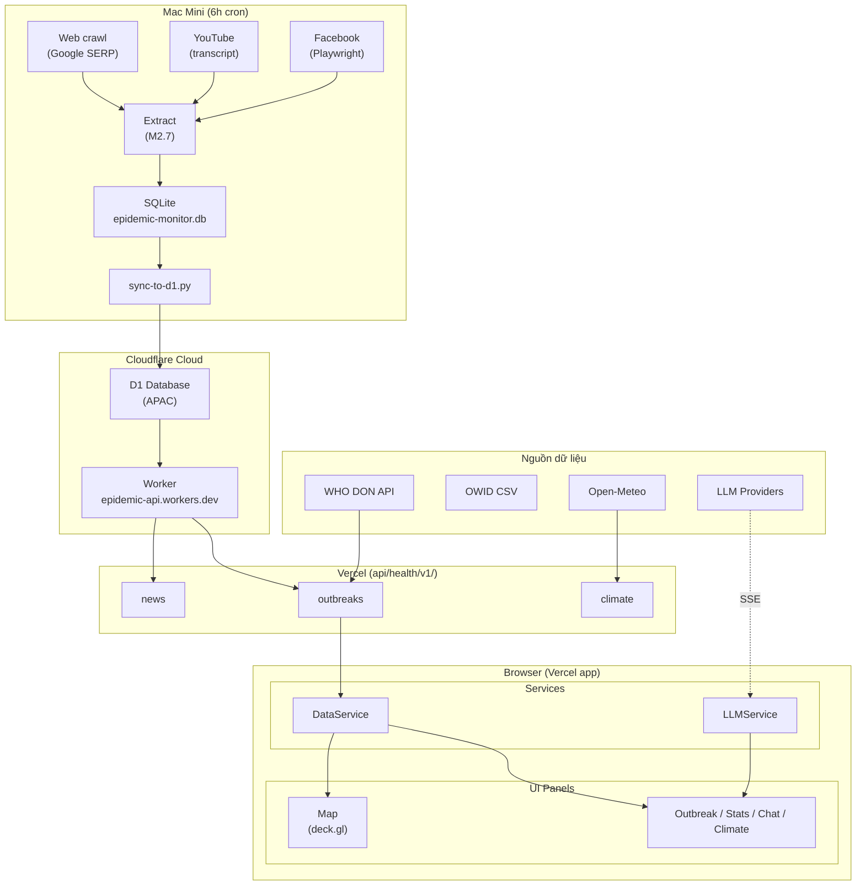
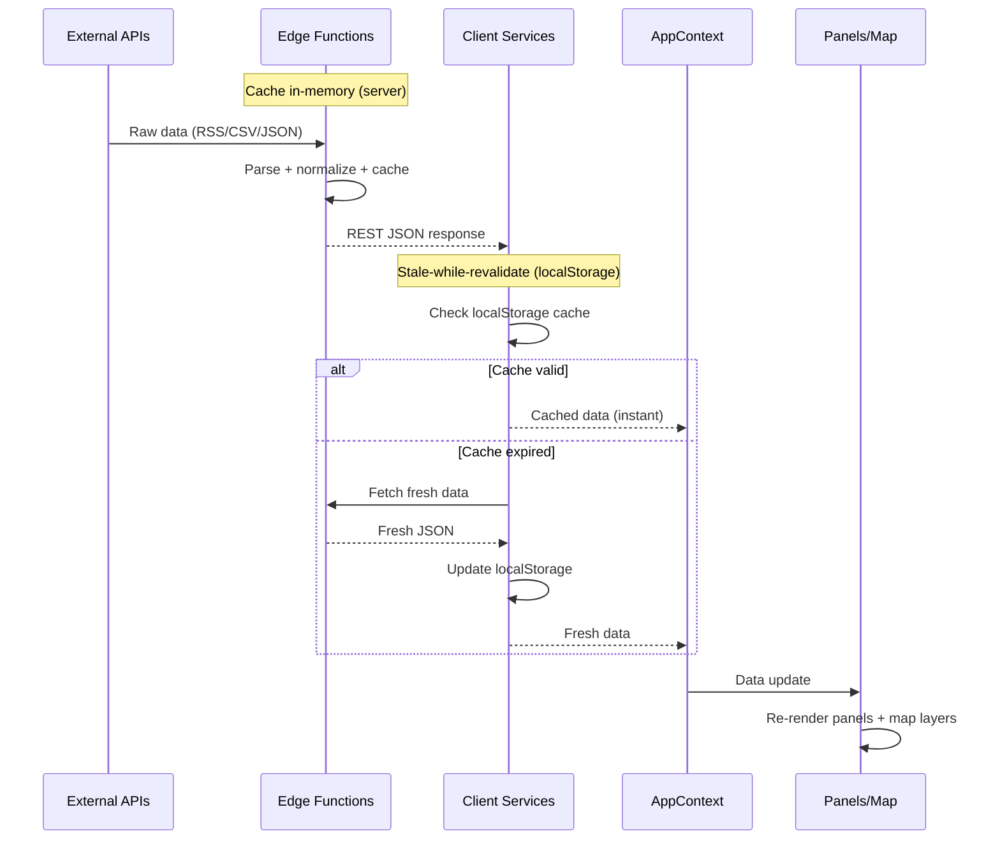
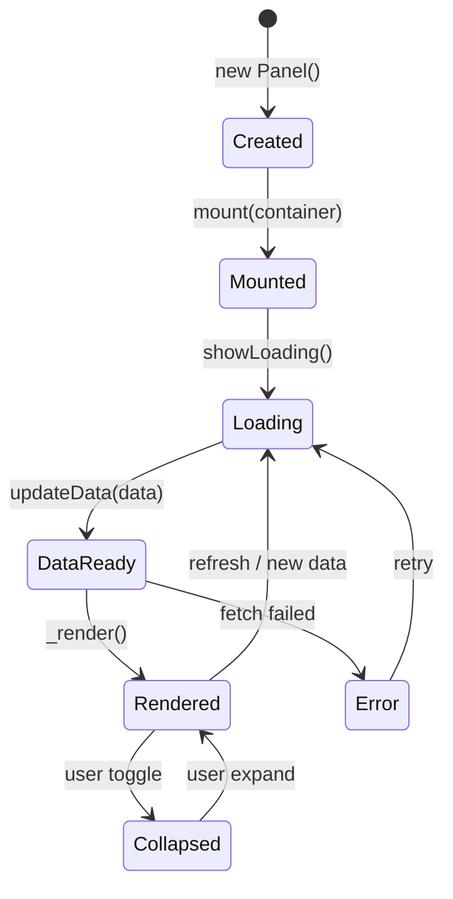
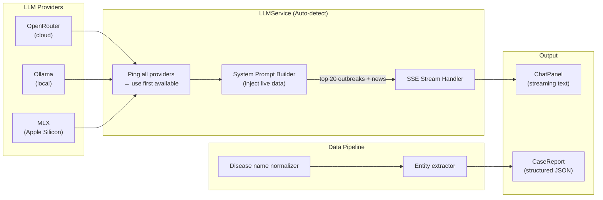
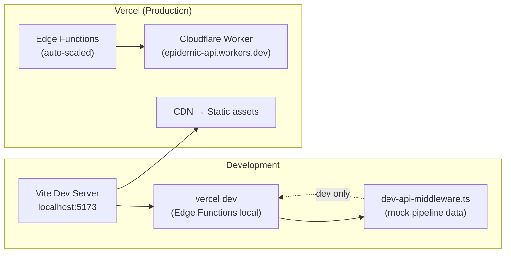

# Kiến Trúc Hệ Thống — Epidemic Monitor

> Tài liệu này dành cho cả developer lẫn người đọc "low-code". Mỗi quyết định kiến trúc đều có giải thích ngắn về **lý do tại sao** không chỉ là cái gì.

---

## Tổng quan

Epidemic Monitor là Vercel web app (display-only) theo dõi dịch bệnh Việt Nam theo thời gian thực. Không chạy pipeline; dữ liệu từ 2 nguồn độc lập:
1. **Quốc tế**: WHO DON API (server-side Vercel)
2. **Việt Nam hotspot**: Cloudflare Worker (`epidemic-api.phucnt.workers.dev`) đọc từ Cloudflare D1

Hệ thống được thiết kế **no-framework** (Vanilla TypeScript) để tránh vendor lock-in, giữ bundle size nhỏ, và tập trung vào display + AI analysis.

**Nguyên tắc thiết kế cốt lõi:**
- **Edge-first**: WHO/VN RSS parse trên Vercel Edge Functions
- **External pipeline**: Mac Mini (`openclaw` repo) crawl báo VN + YouTube + Facebook, extract LLM, ghi SQLite → sync lên Cloudflare D1
- **Cloud DB**: Cloudflare D1 (APAC) là nguồn dữ liệu VN duy nhất phía Vercel — không phụ thuộc Mac Mini uptime
- **Cache tầng đôi**: Server cache in-memory + client cache localStorage
- **Modular panels**: Mỗi panel độc lập, tự quản lý dữ liệu

---

## Kiến trúc hệ thống



**Tại sao Vanilla TypeScript?** Không cần React/Vue — app focus vào display + analysis, không cần component complexity. Bundle nhỏ ~60% hơn framework-based.

**Tại sao Vercel Edge Functions?** Parse WHO-DON + proxy Cloudflare Worker tại CDN edge, latency thấp.

**Tại sao Mac Mini pipeline + Cloudflare D1?** Vietnamese news crawl + extraction phức tạp, cần persistent browser (Playwright). Mac Mini xử lý nặng rồi sync lên D1 mỗi 6h — Vercel không phụ thuộc Mac Mini uptime, URL không bao giờ thay đổi.

---

## Real Data Pipeline

### Tier 1: WHO-DON (Global, Vercel)
- **URL**: WHO Disease Outbreak News REST API
- **Processing**: Vercel Edge → extract disease, countries, severity
- **Items**: ~30-50 global items (low VN overlap)
- **Purpose**: Background signal, international context

### Tier 2: Vietnamese Hotspots (Cloudflare Worker + D1)
- **Source**: Crawl web (Google SERP), YouTube (transcript), Facebook (Playwright) — chạy trên Mac Mini
- **Keywords**: 20+ disease names in Vietnamese
- **Pipeline**: 
  ```
  Daily sources → Google SERP 3-day window → crawl4ai markdown
            ↓
  YouTube RSS (WHO/VTV24/CDC) → get-transcript.sh → MLX Whisper
            ↓
  Facebook pages + search → Playwright+Gemini Vision
            ↓
  extract-m27.py (MiniMax M2.7) → province/district/cases/deaths
            ↓
  db-store.py: validate (63 provinces), dedup (Jaccard 0.6), confidence ≥0.5
            ↓
  SQLite: outbreak_items + hotspots VIEW
            ↓
  sync-to-d1.py (sau mỗi pipeline run) → Cloudflare D1 (APAC)
            ↓
  Cloudflare Worker epidemic-api.phucnt.workers.dev → /hotspots?day= + /news
  ```
- **Current**: 42 items across web/youtube/facebook
- **Quality**: cases_type (cumulative vs outbreak), confidence 0.5-0.95

### Tier 3: Client-side Processing (Browser)
- **Disease normalization**: 67 aliases EN+VN
- **Dedup**: Jaccard 0.4 (news), 0.6 (outbreaks from Mac Mini)
- **IndexedDB**: 30-day snapshots for trend + historical
- **UI panels**: Map, stats, chat, climate alerts

**Architecture Note**: Display-only — data fetching delegated to Cloudflare Worker/D1 + Vercel Edge. Browser never crawls or extracts.

---

## Luồng dữ liệu



**Tại sao stale-while-revalidate?** Người dùng thấy dữ liệu ngay lập tức từ cache, trong khi background fetch cập nhật. UX mượt mà hơn chờ loading mỗi lần mở app. Server cache (in-memory) tránh gọi lặp lại WHO/OWID; client cache (localStorage) cho phép offline-capable.

---

## Hệ thống Panel

Tất cả panels kế thừa từ `PanelBase` — một pattern giống Component nhưng không dùng framework.



**Tại sao self-contained panels?** Mỗi panel fetch dữ liệu riêng và render độc lập — dễ thêm/xóa panel mà không ảnh hưởng panel khác. Panel có 3 state tự quản lý: loading / error / data. **Event Bus** thay thế prop drilling: panel phát `outbreak-selected` → bất kỳ component quan tâm tự lắng nghe, không cần callback chain.

---

## Bản đồ (Map System)

MapShell là wrapper tích hợp hai thư viện bản đồ khác nhau:

- **MapLibre GL**: Render vector tiles (basemap, đường, địa danh)
- **deck.gl**: WebGL layers trên cùng (markers, heatmap, choropleth)

**3 layer types:**

| Layer | Type | Dùng cho |
|-------|------|----------|
| ScatterplotLayer | Điểm tròn có màu | Vị trí ổ dịch |
| HeatmapLayer | Gradient mật độ | Phân bố ca bệnh |
| GeoJsonLayer | Polygon tô màu | Choropleth theo tỉnh |

**Tại sao deck.gl + MapLibre tách biệt?** MapLibre giỏi vector tiles nhưng hạn chế WebGL visualization; deck.gl ngược lại. Kết hợp qua `MapboxOverlay` adapter tận dụng điểm mạnh cả hai. Viewport khóa vào Vietnam (`maxBounds`, `minZoom 4`) vì đây là monitoring tool, không phải bản đồ thế giới.

---

## AI Assistant (LLM System)



**Tại sao OpenAI-compatible API?** Ba provider dùng chung interface — switching provider = đổi base URL, không đổi code. **Inject live data vào system prompt** vì LLM không có real-time knowledge; đưa top 20 outbreaks + news vào context giúp AI trả lời chính xác hơn. **SSE** thay vì WebSocket: streaming một chiều đơn giản hơn, không cần persistent connection, tương thích Edge Functions stateless.

---

## Dự báo khí hậu (Climate Risk)

Open-Meteo cung cấp forecast 14 ngày miễn phí. ClimateService tính risk score theo công thức:

**Risk Score = f(temperature, rainfall, humidity) → [0, 1]**

| Bệnh | Điều kiện HIGH risk |
|------|---------------------|
| Dengue | 25-35°C + mưa >5mm/ngày + độ ẩm >70% |
| HFMD | >28°C + độ ẩm >80% |

**Tại sao tính risk trên client?** Công thức đơn giản, dữ liệu đã có — không cần thêm round-trip lên server. Edge Function chỉ fetch + cache raw weather data.

---

## Deployment

### Tổng quan hệ thống

```
╔══════════════════════════════════════════════════════════════════════╗
║                     HỆ THỐNG EPIDEMIC MONITOR                        ║
╚══════════════════════════════════════════════════════════════════════╝

┌─────────────────────────────────────────────────────────────────────┐
│  BÊN A — Mac Mini (máy vật lý, chạy pipeline)                       │
│                                                                       │
│  [1] epidemic-monitor-pipeline  (openclaw repo)                       │
│      Chạy tự động mỗi 6h (launchd)                                   │
│      Crawl web/YouTube/Facebook → LLM extract → ghi vào SQLite       │
│                      ↓                                               │
│  [2] SQLite (.db file)                                               │
│      Lưu trữ outbreak_items + hotspots VIEW                          │
│                      ↓                                               │
│  [3] sync-to-d1.py                                                   │
│      Sau mỗi pipeline run: đẩy data mới lên Cloudflare D1            │
└──────────────────────────┬──────────────────────────────────────────┘
                           │  Cloudflare D1 API (write)
                           ↓
┌─────────────────────────────────────────────────────────────────────┐
│  BÊN B — Cloudflare Cloud (luôn online, độc lập Mac Mini)           │
│                                                                       │
│  [4] D1 Database "epidemic-monitor" (APAC region)                    │
│      Lưu trữ toàn bộ hotspot data — không phụ thuộc Mac Mini        │
│                      ↓                                               │
│  [5] Cloudflare Worker epidemic-api.phucnt.workers.dev               │
│      GET /hotspots?day=YYYY-MM-DD  GET /news?limit=50               │
│      Auth: X-Api-Key header                                          │
└──────────────────────────┬──────────────────────────────────────────┘
                           │  HTTPS (URL cố định, không đổi)
                           ↓
┌─────────────────────────────────────────────────────────────────────┐
│  BÊN C — Vercel (cloud, auto-scale)                                  │
│                                                                       │
│  [6] outbreaks.ts / news.ts (Edge Functions)                         │
│      Gọi Cloudflare Worker + WHO DON REST API                        │
│      Trả về cho UI                                                   │
│                      ↓                                               │
│  [7] UI (SPA — Vanilla TypeScript + deck.gl)                         │
│      Hiển thị danh sách outbreak, filter, map, chat AI...            │
└─────────────────────────────────────────────────────────────────────┘
```

### Khi nào cần làm gì?

```
╔══════════════════════════════════════════════════════════════════════╗
║  KHI NÀO CẦN LÀM GÌ?                                                ║
╠══════════════════════════════════════════════════════════════════════╣
║                                                                      ║
║  SỬA CODE [1] pipeline script           → restart launchd plist     ║
║  SỬA CODE [3] sync-to-d1.py            → restart launchd plist     ║
║  SỬA CODE [5] Worker (epidemic-api)     → wrangler deploy           ║
║                                                                      ║
║  SỬA CODE [6] outbreaks.ts (Edge fn)   → commit + push → auto      ║
║  SỬA CODE [7] UI components             → commit + push → auto      ║
║  THÊM ENV VAR mới trên Vercel           → redeploy trên dashboard   ║
║                                                                      ║
╠══════════════════════════════════════════════════════════════════════╣
║  KHÔNG CẦN DEPLOY KHI:                                               ║
║  • Pipeline crawl xong → sync-to-d1 tự chạy → D1 tự cập nhật       ║
║  • Mac Mini restart/offline → D1 vẫn có data → frontend không bị    ║
║  • Thêm disease slug vào DISEASES list → commit+push là đủ           ║
║  • Sửa dev-api-middleware.ts (dev only) → chỉ cần restart dev server ║
╚══════════════════════════════════════════════════════════════════════╝
```

| Layer | "Deploy" | Cách thực hiện |
|-------|----------|----------------|
| Mac Mini pipeline | Không deploy — chỉ restart process | `launchctl kickstart` |
| Cloudflare Worker | `wrangler deploy` (trong thư mục epidemic-api-worker) | `wrangler deploy` |
| Vercel | commit + push → auto deploy (2-3 phút) | `git push` |

### Vercel environment variables

| Biến | Mục đích |
|------|----------|
| `EPIDEMIC_API_URL` | `https://epidemic-api.phucnt.workers.dev` — URL cố định, không thay đổi |
| `EPIDEMIC_API_KEY` | API key cho Cloudflare Worker endpoint |

### Dev environment



**Vercel**: zero-config, edge functions tự scale. **Dev middleware**: simulate pipeline response locally mà không cần kết nối cloud. 15 Playwright E2E tests cover critical flows.

---

## Tóm tắt các quyết định kiến trúc

| Quyết định | Lựa chọn | Lý do |
|------------|----------|-------|
| Framework | Vanilla TS | Bundle nhỏ, không vendor lock-in |
| Bản đồ | MapLibre + deck.gl | Tách basemap vs WebGL visualization |
| Serverless | Vercel Edge | Latency thấp, gần user |
| VN Data backend | Cloudflare Worker + D1 | URL cố định, không phụ thuộc Mac Mini uptime |
| LLM | OpenAI-compatible | Swap provider không đổi code |
| Cache | In-memory + localStorage | UX nhanh + giảm API calls |
| Streaming | SSE | Đơn giản hơn WebSocket cho one-way stream |
| Panel pattern | Self-contained | Fault isolation, dễ mở rộng |
