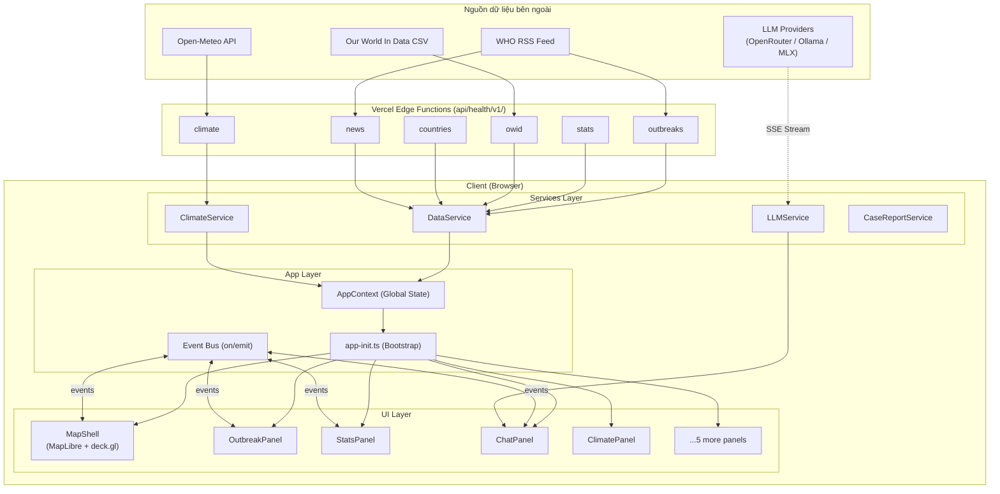
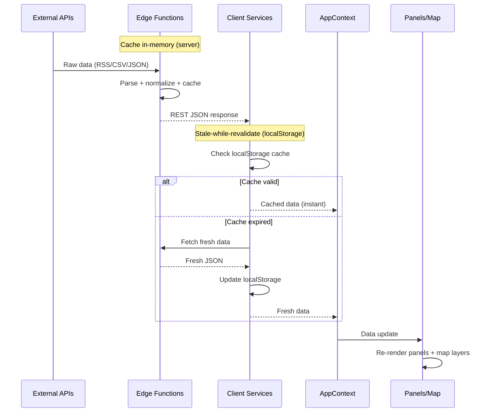
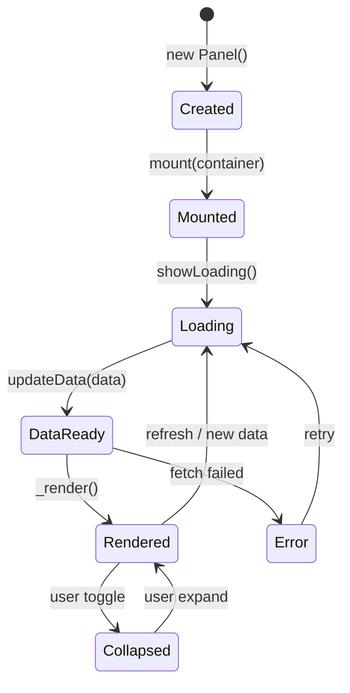
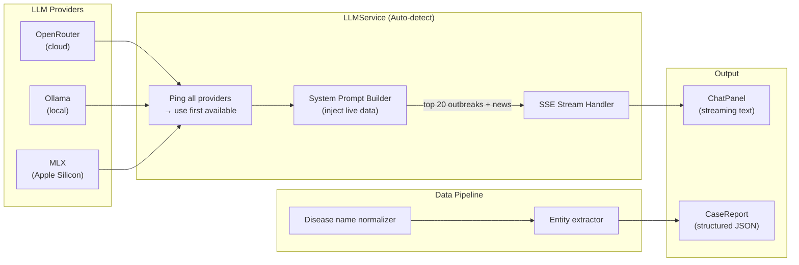
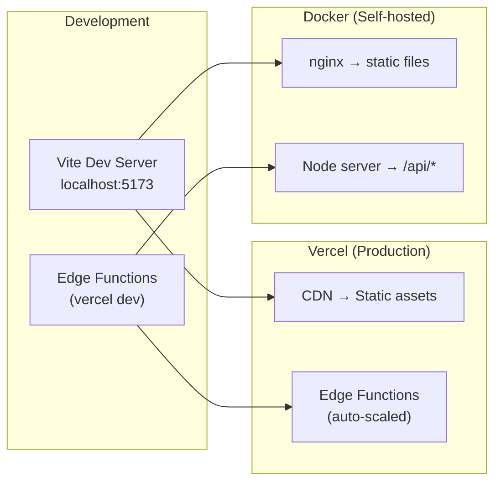

# Kiến Trúc Hệ Thống — Epidemic Monitor

> Tài liệu này dành cho cả developer lẫn người đọc "low-code". Mỗi quyết định kiến trúc đều có giải thích ngắn về **lý do tại sao** không chỉ là cái gì.

---

## Tổng quan

Epidemic Monitor là ứng dụng web theo dõi dịch bệnh theo thời gian thực, hiển thị dữ liệu trên bản đồ tương tác và cung cấp AI Assistant để phân tích. Hệ thống được thiết kế theo nguyên tắc **no-framework** (Vanilla TypeScript) để tránh vendor lock-in và giữ bundle size nhỏ.

**Nguyên tắc thiết kế cốt lõi:**
- **Edge-first**: Logic xử lý dữ liệu chạy trên server gần người dùng nhất (Vercel Edge Functions)
- **Cache tầng đôi**: Server cache in-memory + client cache localStorage → giảm tải API bên thứ ba
- **Modular panels**: Mỗi panel là một widget độc lập, tự quản lý dữ liệu và rendering

---

## Kiến trúc hệ thống

**Tại sao Vanilla TypeScript?** Không cần React/Vue cho một SPA có UI tương đối tĩnh — tránh overhead của virtual DOM, bundle nhỏ hơn ~60%, và không bị ràng buộc bởi framework lifecycle.

**Tại sao Vercel Edge Functions?** Chạy tại CDN edge nodes, latency thấp hơn serverless thông thường. Quan trọng hơn: parse RSS/CSV phức tạp không nên chạy trên browser vì tốn CPU và gây CORS issues.

---

## Luồng dữ liệu

**Tại sao stale-while-revalidate?** Người dùng thấy dữ liệu ngay lập tức từ cache, trong khi background fetch cập nhật. UX mượt mà hơn chờ loading mỗi lần mở app. Server cache (in-memory) tránh gọi lặp lại WHO/OWID; client cache (localStorage) cho phép offline-capable.

---

## Hệ thống Panel

Tất cả panels kế thừa từ `PanelBase` — một pattern giống Component nhưng không dùng framework.

**Tại sao self-contained panels?** Mỗi panel fetch dữ liệu riêng và render độc lập — dễ thêm/xóa panel mà không ảnh hưởng panel khác. Panel có 3 state tự quản lý: loading / error / data. **Event Bus** thay thế prop drilling: panel phát `outbreak-selected` → bất kỳ component quan tâm tự lắng nghe, không cần callback chain.

---

## Bản đồ (Map System)

MapShell là wrapper tích hợp hai thư viện bản đồ khác nhau:

- **MapLibre GL**: Render vector tiles (basemap, đường, địa danh)
- **deck.gl**: WebGL layers trên cùng (markers, heatmap, choropleth)

**3 layer types:**

| Layer | Type | Dùng cho |
|-------|------|----------|
| ScatterplotLayer | Điểm tròn có màu | Vị trí ổ dịch |
| HeatmapLayer | Gradient mật độ | Phân bố ca bệnh |
| GeoJsonLayer | Polygon tô màu | Choropleth theo tỉnh |

**Tại sao deck.gl + MapLibre tách biệt?** MapLibre giỏi vector tiles nhưng hạn chế WebGL visualization; deck.gl ngược lại. Kết hợp qua `MapboxOverlay` adapter tận dụng điểm mạnh cả hai. Viewport khóa vào Vietnam (`maxBounds`, `minZoom 4`) vì đây là monitoring tool, không phải bản đồ thế giới.

---

## AI Assistant (LLM System)

**Tại sao OpenAI-compatible API?** Ba provider dùng chung interface — switching provider = đổi base URL, không đổi code. **Inject live data vào system prompt** vì LLM không có real-time knowledge; đưa top 20 outbreaks + news vào context giúp AI trả lời chính xác hơn. **SSE** thay vì WebSocket: streaming một chiều đơn giản hơn, không cần persistent connection, tương thích Edge Functions stateless.

---

## Dự báo khí hậu (Climate Risk)

Open-Meteo cung cấp forecast 14 ngày miễn phí. ClimateService tính risk score theo công thức:

**Risk Score = f(temperature, rainfall, humidity) → [0, 1]**

| Bệnh | Điều kiện HIGH risk |
|------|---------------------|
| Dengue | 25-35°C + mưa >5mm/ngày + độ ẩm >70% |
| HFMD | >28°C + độ ẩm >80% |

**Tại sao tính risk trên client?** Công thức đơn giản, dữ liệu đã có — không cần thêm round-trip lên server. Edge Function chỉ fetch + cache raw weather data.

---

## Deployment

**Vercel**: zero-config, edge functions tự scale, phù hợp demo/production nhanh. **Docker + nginx**: self-hosted cho môi trường yêu cầu data sovereignty. 15 Playwright E2E tests cover critical flows — E2E thay vì unit tests vì phần lớn logic là UI orchestration.

---

## Tóm tắt các quyết định kiến trúc

| Quyết định | Lựa chọn | Lý do |
|------------|----------|-------|
| Framework | Vanilla TS | Bundle nhỏ, không vendor lock-in |
| Bản đồ | MapLibre + deck.gl | Tách basemap vs WebGL visualization |
| Serverless | Vercel Edge | Latency thấp, gần user |
| LLM | OpenAI-compatible | Swap provider không đổi code |
| Cache | In-memory + localStorage | UX nhanh + giảm API calls |
| Streaming | SSE | Đơn giản hơn WebSocket cho one-way stream |
| Panel pattern | Self-contained | Fault isolation, dễ mở rộng |
